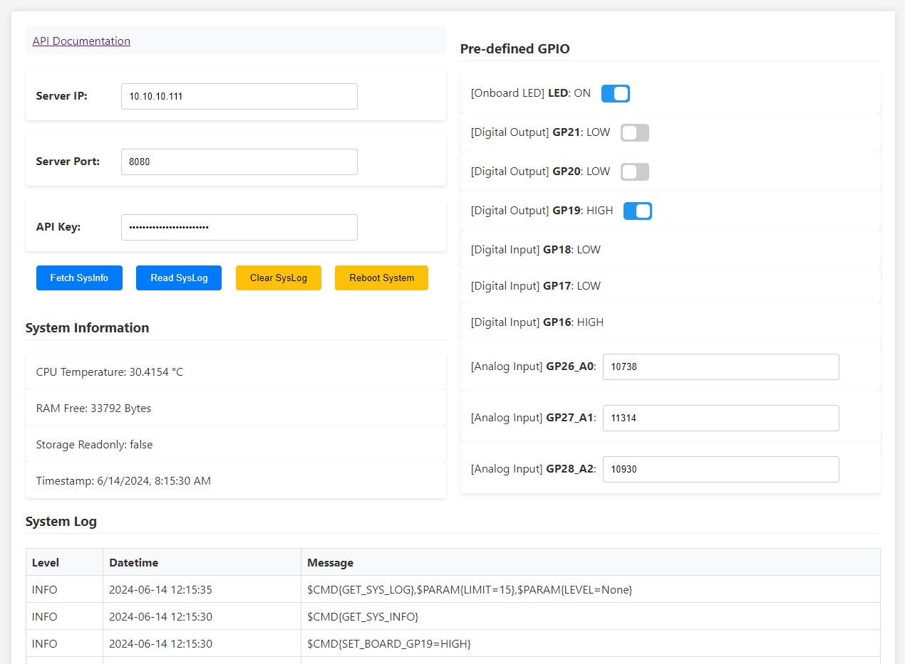

# Pico W API Server
An API server system implemented using CircuitPython 9.x on a Raspberry Pi Pico W, designed to manage HTTP requests and responses between you and your Pico W board. This system can function as a test bench for your hardware modules or as a foundational skeleton for further development of your Pico W projects.

A web GUI that implements the APIs for demonstration purposes can be found at "/GUI/web_gui.html":

## Quick Depolyment

1. Install Adafruit CircuitPython 9.x
    - hold BOOTSEL and connect Pico W to a computer
    - copy /Firmware/adafruit-circuitpython-raspberry_pi_pico_w-en_US-9.0.5.uf2 to Pico W Drive

2. Install picow_api_server
    - delete everything in your Pico W CIRCUITPY Drive
    - copy everything from /CIRCUITPY to your Pico W CIRCUITPY Drive

3. Config your server
    - rename example_settings.toml to settings.toml
    - edit settings.toml with your WIFI SSID/PASSWD and customized API-KEY

4. (Optional) Enable storage write
    - Physically connect the GP22 pin to GND if you wish to enable storage write(implemented in boot.py).
    - By default, the CIRCUITPY drive is read-only to CircuitPython and writable by your computer. When the pin is connected, the CIRCUITPY drive becomes writable by CircuitPython and read-only by your computer.
    - Enabling storage write will automatically activate Logger file mode. A "syslog.txt" file will be generated at the root path of your Pico W CIRCUITPY Drive. This log file can be accessed and operated via API commands.

## Dependency
- Adafruit CircuitPython 9.x
    - https://github.com/adafruit/circuitpython
    - A copy of CircuitPython 9.0.5 (.uf2 file) is included at /Firmware
- adafruit_requests
    - https://github.com/adafruit/Adafruit_CircuitPython_Requests
    - A copy of adafruit_requests 4.0.0 (.py file) is included at /CIRCUITPY/lib
- adafruit_connection_manager
    - https://github.com/adafruit/Adafruit_CircuitPython_ConnectionManager/
    - A copy of adafruit_connection_manager 3.1.0 (.py file) is included at /CIRCUITPY/lib
- adafruit_httpserver
    - https://github.com/adafruit/Adafruit_CircuitPython_HTTPServer
    - A copy of adafruit_httpserver 4.5.8 (.mpy files) is included at /CIRCUITPY/lib
- adafruit_ntp
    - https://github.com/adafruit/Adafruit_CircuitPython_NTP
    - A copy of adafruit_ntp 3.1.1 (.py file) is included at /CIRCUITPY/lib

## Reference

*Pins on the right side of the Pico W (GP28, GP27, GP26, GP22, GP21, GP20, GP19, GP18, GP17, GP16) have been predefined for demonstration purposes. Of course, you can customize the GPIOs based on your needs by modifying "/lib/red_api_server.py".